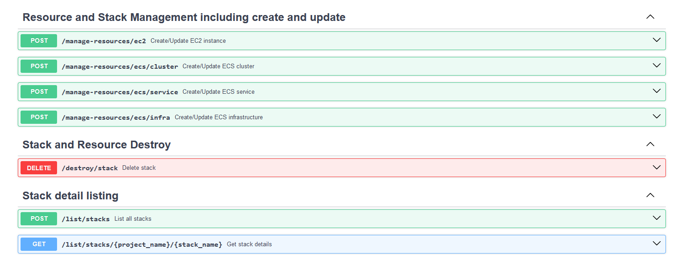

# 🌟 Pulumi Python + FastAPI POC Project 🌟

A **Proof of Concept (POC)** showcasing the integration of **Pulumi Python** with **FastAPI** via the **Pulumi
Automation SDK**. 🎉 
This project demonstrates how Pulumi's IaC capabilities, in conjunction with FastAPI, can create RESTful endpoints for
managing cloud resources dynamically.

---

## 🏗️ Project Scope

The goal of this project is to develop an **Infrastructure as Code (IaC) SaaS** platform that allows users to manage
cloud resources through REST endpoints.

---

### 🌟 Features

- **Cloud Resource Support**:
    - **EC2 Instances** 🖥️
    - **IAM Roles** 🛡️
    - **ECS Fargate Clusters** 🚢
    - **Security Groups** 🔒
- **RESTful Endpoints**:
    - All endpoints are available via **OpenAPI Swagger**: [http://localhost:8001/docs](http://localhost:8001/docs)
- **Pulumi State Management**:
    - Stateful management for consistent cloud deployments.
    - Full lifecycle operations including `CREATE`, `PREVIEW`, `UP`, and `DESTROY`.



---

## 📋 Prerequisites

Ensure the following prerequisites are met before running the application:

1. **Pulumi Access Token**: Generate a token from [Pulumi Tokens](https://app.pulumi.com/user/settings/tokens) and set
   it as an environment variable:
   ```plaintext
   PULUMI_ACCESS_TOKEN=<your_pulumi_access_token>
   ```
2. **AWS CLI Default Profile**: AWS credentials should be properly configured in the default profile.
3. **Database Configuration** (Required for resource tracking):
    - Set up a PostgreSQL database and configure the following environment variable:
      ```plaintext
      DB_CONNECTION_STRING=postgresql+psycopg2://<username>:<password>@<host>:<port>/<database>
      ```
    - This will store state and configuration for created resources.
4. Tooling:
    - **Python** 🐍
    - **Pip** 📦
    - **Pulumi CLI** 🔧
    - (**Optional**) **AWS CLI** 🪄

---

## 🚀 How to Start the Application

1. Run the main application:
   ```bash
   python __main__.py
   ```
2. The application will start locally at: [http://localhost:8001](http://localhost:8001)

---

## ✨ Why Pulumi?

**Pulumi** enables **stateful IaC implementation** with robust state management, multi-cloud adaptability, and APIs for
automation. Key advantages include:

1. 🌎 **Multi-cloud Adaptability**: Centralized logic across cloud platforms.
2. 💾 **State Management**: Pulumi ensures resources remain consistent with defined states.
3. 🛠️ **SaaS/Automation-Friendly**: Powered by the Automation SDK for easier development of scalable tools.

---

## 🗄️ Database Integration

This project uses PostgreSQL for managing resource and stack configurations.

### **Configuration**

- Set the `DB_CONNECTION_STRING` environment variable for database connectivity:
  ```plaintext
  DB_CONNECTION_STRING=postgresql+psycopg2://<username>:<password>@<host>:<port>/<database>
  ```

### **Data Stored**

Whenever resources (stacks) are created or modified, the following details are tracked in the database:

- `id`: Unique identifier for the stack.
- `project_name`: Project name associated with the stack.
- `stack_name`: Name of the stack.
- `created_at`: Timestamp of creation.
- `updated_at`: Timestamp of the last update.
- `stack_configuration`: JSON configuration of the stack.
- `stack_output`: JSON output of the stack's results.

The table structure is optimized for tracking resource lifecycle, state, and output.

---

## 🎯 Core Endpoints and Actions

Below is a high-level overview of the available controllers and their functionalities.

---

### 🔍 Stack Management

- **Get Stack Details**: `/stacks/{project_name}/{stack_name}` (GET)
    - Fetches stack configuration and status.

---

### 🚢 ECS Management

#### **Manage ECS Infrastructure**

- **Endpoint**: `/manage-resources/ecs/infra` (POST)
- **Description**: Enables the creation and management of ECS infrastructure, including both ECS clusters and Fargate
  services.

#### **Benefits**

- **Stateful Resource Management**: Each created cluster and service is treated as a dedicated resource with its own
  state, ensuring precise tracking and lifecycle management.
- **Seamless Resource Separation**: Provides effective segmentation and isolation of resources, making them easier to
  manage individually.
- **Scalability**: Supports the creation of multiple clusters and services, allowing for flexible and scalable
  infrastructure design.

#### ***Note: This is a POC, async deployments are not covered***


**Request Payload Example**:
```json
{
  "stack_name": "poc",
  "project_name": "automation-dev",
  "ecs_cluster": [
    {
      "ecs_cluster": {
        "cluster_name": "poc-int"
      }
    },
    {
      "ecs_cluster": {
        "cluster_name": "poc-ext"
      }
    }
  ],
  "ecs_fargate_services": [
    {
      "ecs_fargate": {
        "name": "poc-int-srv",
        "subnet_ids": [
          "subnet-0ac23ab19ef387fbc"
        ],
        "vpc_id": "vpc-01c3be072799793f4",
        "container_definitions": {
          "container_name": "poc-int",
          "image": "poc-int:latest"
        },
        "desired_count": 1,
        "enable_load_balancer": false,
        "enabled": true,
        "cluster_name": "poc-int-cluster"
      }
    },
    {
      "ecs_fargate": {
        "name": "poc-ext-srv",
        "subnet_ids": [
          "subnet-0ac23ab19ef387fbc"
        ],
        "vpc_id": "vpc-01c3be072799793f4",
        "container_definitions": {
          "container_name": "poc-ext",
          "image": "poc-ext:latest"
        },
        "desired_count": 1,
        "enable_load_balancer": false,
        "enabled": true,
        "cluster_name": "poc-ext-cluster"
      }
    }
  ]
}
```

---

### 🔍 Stack Operations

#### **List Stacks**

- **Endpoint**: `/list/stacks` (POST)

**Request Payload**:

```json
{
  "project_name": "automation-dev"
}
```

#### **Delete Stack**

- **Endpoint**: `/destroy/stack` (DELETE)

**Request Payload Example**:
```json
{
  "project_name": "automation-dev",
  "stack_name": "ec2-instance"
}
```

---

## 🔗 Conclusion

This POC demonstrates how Pulumi’s powerful **stateful IaC** and **Automation SDK** can integrate with **FastAPI** to
build scalable and dynamic cloud resource management tools. While this implementation isn't production-ready, it offers
a concrete foundation for further development.

⚠️ **Note**: Use this project as a learning tool and reference, not for production environments.